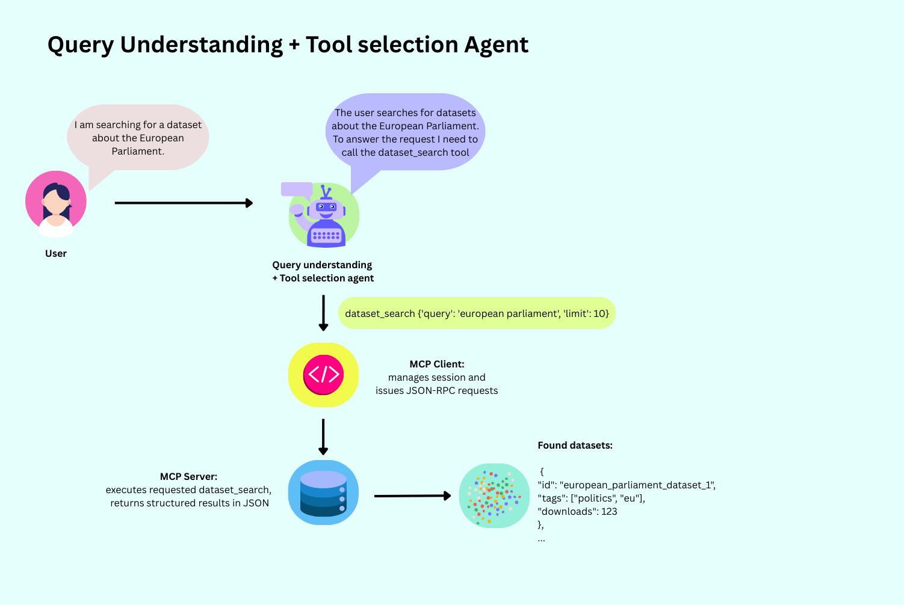
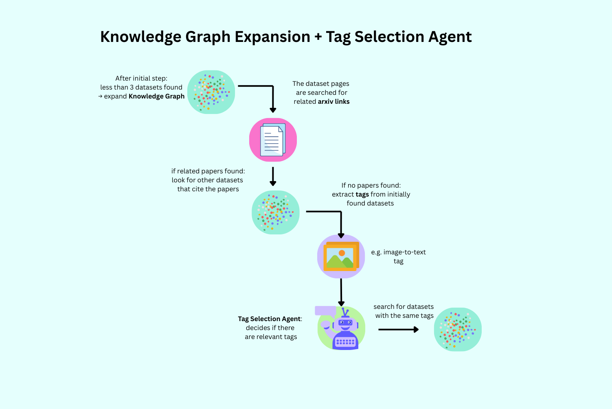
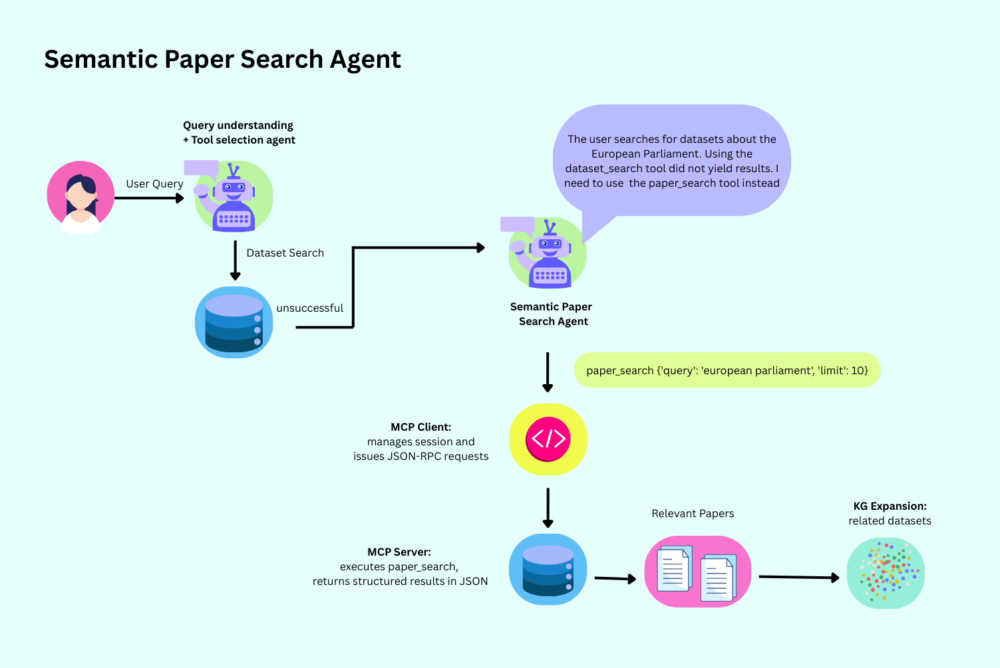
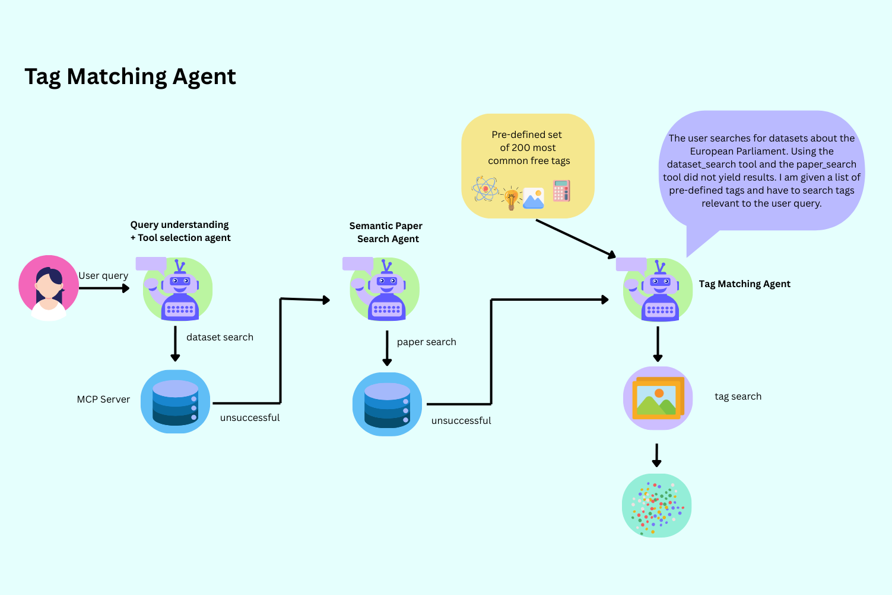
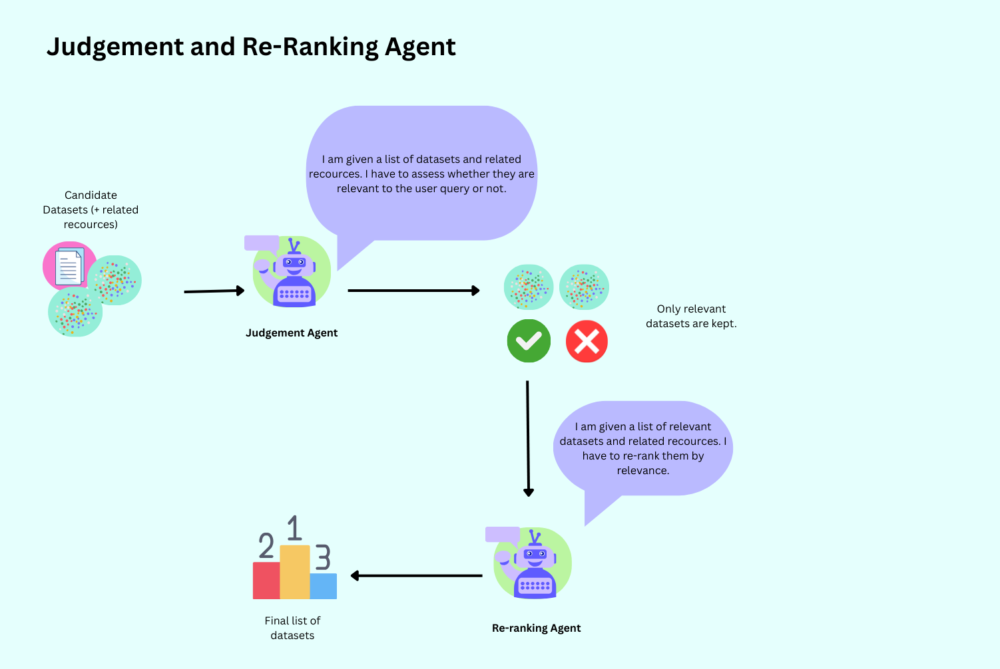
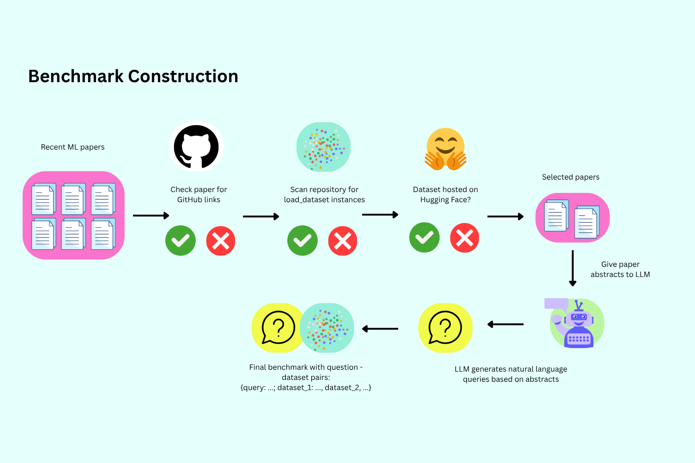

# DatasetChat 🐸

LLM-driven multi-agent chatbot for dataset retrieval on the Hugging Face Hub (ongoing development phase).

🔗 **Live Demo (Hugging Face Space):**  
https://huggingface.co/spaces/HeHanna/DatasetChat

---

## 📚 Table of Contents

- [Overview](#-overview)
- [Motivation](#-motivation)
- [Approach](#-approach)
- [System Architecture](#-system-architecture)
- [Agents](#-agents)
- [Knowledge Graph](#-knowledge-graph)
- [Benchmark](#-benchmark)
- [Limitations](#-limitations)
- [Timeline](#-timeline)

---

## 🔍 Overview

- Multi-agent chatbot for **dataset discovery**
- Built on:
  - LLM-based reasoning
  - Hugging Face MCP server
- Supports:
  - Natural language queries
  - Iterative search
  - Interactive exploration

---

## Motivation

- Dataset retrieval is challenging because:
  - ❌ Missing abstracts
  - ❌ Sparse / noisy metadata
  - ❌ Semantic mismatch between queries and datasets

- Traditional retrieval problems:
  - Keyword search → lexical mismatch
  - Embeddings → unreliable with weak metadata
  - Single-shot systems → no exploration

- Goal:
  - Combine **LLMs + retrieval + knowledge graphs**
  - Enable **interactive dataset search**

---

## Approach

- Multi-agent system with:
  - LLM-based tool orchestration
  - Rule-based fallback strategies
  - Dynamic knowledge graph expansion

- Key features:
  - 🔁 Iterative retrieval
  - 🔀 Query reformulation
  - 🧑‍💻 Human-in-the-loop interaction

---

## System Architecture

- Retrieval pipeline:
  - Query understanding
  - Dataset search
  - Judgment & re-ranking
  - Fallback strategies

- If search fails:
  - Paper-based expansion
  - Tag-based expansion
  - Query reformulation

---

## 🤖 Agents

### 1. Query / Tool Selection Agent

- Interprets user query
- Selects MCP tools (e.g. `dataset_search`)
- Minimizes unnecessary calls

---

### 2. Knowledge Graph Expansion

- Triggered if results < 3
- Expands via:
  - 📄 Papers linked to datasets
  - 🏷️ Tags from datasets

---

### 3. Tag Selection Agent

- Filters relevant tags
- Improves semantic expansion

---

### 4. Semantic Paper Search Agent

- Used when no datasets found
- Actions:
  - Finds relevant papers
  - Extracts datasets from papers
  - Reformulates query

---

### 5. Tag Matching Agent

- Final fallback
- Matches query to predefined tag vocabulary

---

### 6. Judgment & Re-ranking Agents

- Judgment Agent:
  - Filters irrelevant datasets
- Re-ranking Agent:
  - Ranks by:
    - Popularity
    - Recency
    - Documentation quality

---

## Knowledge Graph

- Dynamic, query-specific graph:

- Nodes:
  - Dataset
  - Paper
  - Model

- Relations:
  - dataset → paper
  - paper → dataset/model
  - dataset ↔ dataset (shared tags)

- Purpose:
  - Improve retrieval under sparse metadata
  - Enable multi-hop exploration

---

## 📊 Benchmark

- Based on scientific papers
- Pipeline:
  - Extract papers (HF, arXiv, PapersWithCode)
  - Generate queries from abstracts
  - Extract datasets via GitHub
  - Match with Hugging Face datasets

- Evaluation metrics:
  - MRR
  - Precision@K
  - MAP

- Baseline:
  - HuggingChat

---

## ⚠️ Limitations

- Restricted to Hugging Face ecosystem
- Depends on:
  - Metadata quality
  - Tag availability
- LLM risks:
  - Hallucinations
  - Query misinterpretation

---

## 🗓️ Timeline

- ✅ Core system implemented
- 🔄 Improvements ongoing
- 📌 Next steps:
  - Benchmark construction
  - Evaluation (MRR, MAP, P@K)
  - Comparison with HuggingChat

---
---

---
title: DatasetChat
emoji: 🐠
colorFrom: blue
colorTo: red
sdk: gradio
sdk_version: 6.11.0
app_file: app.py
pinned: false
short_description: Find suitable datasets for your research projects
---

Check out the configuration reference at https://huggingface.co/docs/hub/spaces-config-reference
